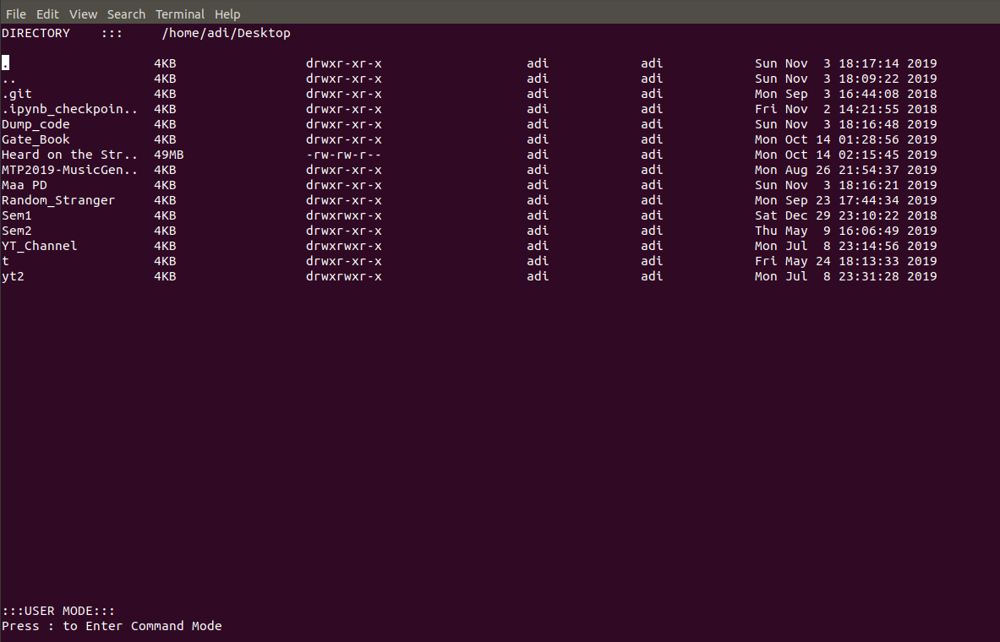
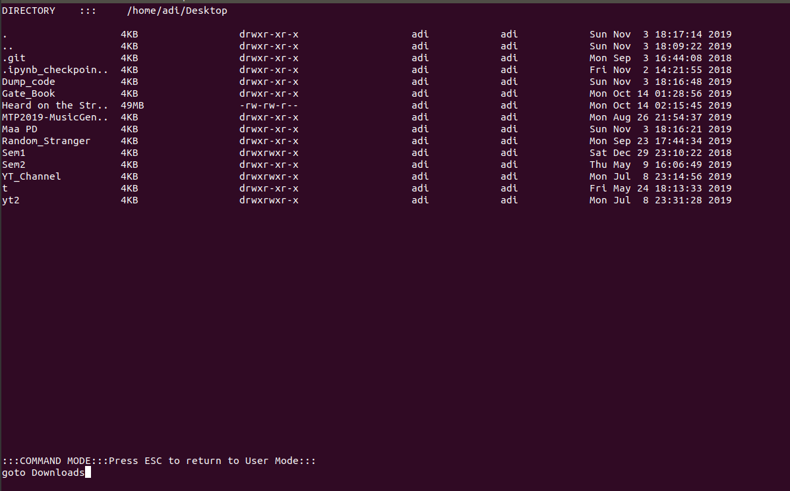

# Project :  Linux Terminal Based File Explorer


### Basic Requirements

* #### G++  : 
	* ``` sudo apt-get install g++ ```
	* ``` g++ --version ```


## Clone and compile the project

1. ### Clone : 
	* ``` git clone https://github.com/adi-iiith/Linux-Terminal_File_Explorer.git ```

2. Goto the Project directory and run the following command : 

	* ``` make ```

3. If you want to make changes and recompile the code, run the following commands : 

	* ``` make clean ```
	* ``` make ```
4. ### Run the project : 

	* ``` ./module1 ```

5. ### Functionalies of TFE 

	- Refer to the ``` Project Specs.pdf ``` for mode details.

 File explorer works in two modes. 

* The application is start in normal mode, which is the default User mode and used to explore the current directory and navigate around in the filesystem.
<br/>
* The root of the application is the directory where the application was started.
<br/>
* The last line of the display screen is to be used as status bar - to be used in normal and command-line modes.


6. ### User Mode : 

**Read and display list of files and directories in the current folder**
* File explorer show each file in the directory (one entry per line). The following attributes are visible for each file
    * File Name
    * File size (Human readable format similar to ``` ls -lh ``` )
    * Ownership (User & Group) & Permissions
    * Last modified

* The File explorer also handle scrolling (vertical overflow) in case the directory has a lot of files. On an average 32 listings are allowed and others are displayed after scrolling. 
* The file explorer also show the entries ```.``` & ```..``` for current and parent directory respectively.
* User can navigate up & down the file list using corresponding arrow keys.



1.2 **Open files & directories**
* When enter is pressed
    * Directory​ - It will Clear the screen and Navigate into the directory and shows the files & directories inside.
    * Files​ - It will open files using the corresponding default application.

7. ### Command Mode:
The application is enter the command mode whenever the ```:``` (colon) key
is pressed. 
All commands appear in a bottom status bar.




* **copy, move and rename** 
```
copy <source_file(s)> <destination_directory>
move <source_file(s)> <destination_directory>
```
```
Eg:
copy abc.txt def.txt xyz.mp4 ~/foobar
move abc.txt def.txt xyz.mp4 ~/foobar
rename abc.txt def.txt
```
```
similar commands for copy, move and rename for directories
```

* **delete files and directories** 
```
delete_file <file_path>
delete_dir <directory_path>
```
```
Eg:
delete_file ~/abc/def.txt.
delete_dir ~/abc/def
```

* **goto** 
```
goto <directory_path>
```
```
Eg:
goto Downloads
goto ~
```
```
both absolute and relative path are supported
```
* **Search a file or folder given fullname.** 
```
search <filename>
```
```
Eg:
search abc.txt
```
```
Searches for the given filename under the current directory recursively.
```
* **Snapshotting the filesystem and dump into a file** 
```
snapshot <folder> <dumpfile>​
```
```
Eg:
snapshot ~/foobar/ abc
```
* Given a base directory this command recursively crawl the directory and store the output in dumpfile.

* Given a base directory this command recursively crawl the directory and store the output in dumpfile.

* It is similar to ```ls -R``` command of Linux. 


* **On pressing ```ESC``` key the application goes to Normal Mode**

8. ### Exit :

* Pressing ```q or Q``` exits the application. 


